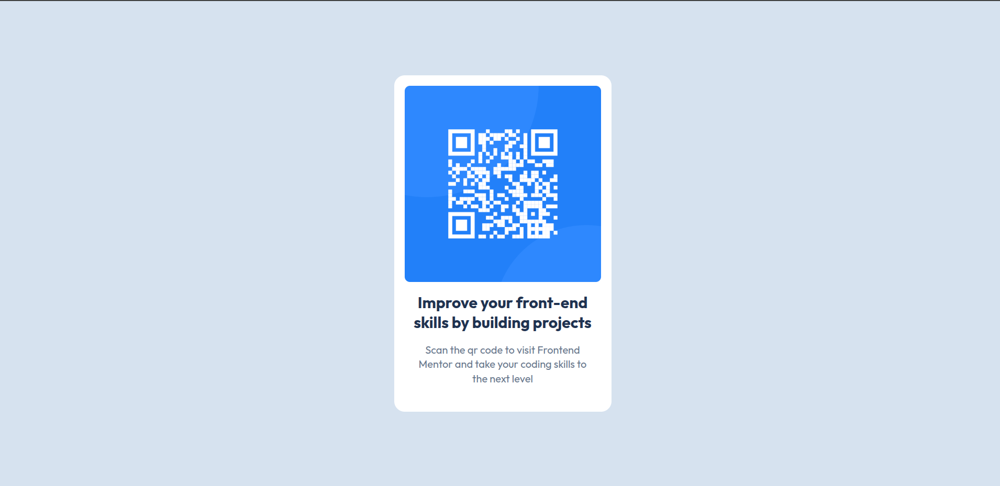
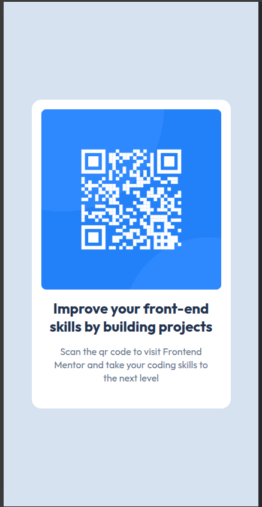

# Frontend Mentor - QR code component solution

This is a solution to the [QR code component challenge on Frontend Mentor](https://www.frontendmentor.io/challenges/qr-code-component-iux_sIO_H). Frontend Mentor challenges help you improve your coding skills by building realistic projects.

## Table of contents

- [Overview](#overview)
  - [Screenshot](#screenshot)
  - [Links](#links)
- [My process](#my-process)
  - [Built with](#built-with)
  - [What I learned](#what-i-learned)
  - [Continued development](#continued-development)
  - [Useful resources](#useful-resources)
- [Author](#author)
- [Acknowledgments](#acknowledgments)

**Note: Delete this note and update the table of contents based on what sections you keep.**

## Overview

### Screenshot





### Links

- Solution URL:(https://github.com/apsbundela/fem-qr-card-design)
- Live Site URL:(https://your-live-site-url.com)

## My process

### Built with

- Semantic HTML5 markup
- CSS properties
- Flexbox

### What I learned

- At first, I struggled to center the card and ended up adding unnecessary wrapper `<div>` elements. After reviewing a simpler HTML structure, I realized that I could achieve the same result by applying Flexbox directly on the `body`. This helped me understand that clean structure often solves layout problems better than adding more elements.

  **Before (over-structured):**
  ```html
  <div class="page-container">
    <section class="qr-card-wrapper">
      <div class="qr-card-container">
        ...
      </div>
    </section>
  </div>

- I understood how box-sizing: border-box works and why it is commonly applied globally. It ensures that padding and borders are included in an element’s total width and height, making layout calculations more predictable.

- I learnt to import google font in code. Go to google font > search font & select > Get font > Get embeded code > 1.Link 2.@import
  I used link, copied to html head and directly utilized font family in calss.

- I initially struggled to center the card because I assumed it would be centered automatically, even without setting the full viewport height (`100vh`). After some research using Google and AI tools, I understood why defining the viewport height is important when centering elements with Flexbox.


- (Still Need clarification) I learned that images do not always need to be wrapped in an extra container. If the image only needs basic styling like width, height, or border-radius, it can be styled directly. Wrappers are only useful when additional layout control, overlays, or aspect-ratio handling is required.


### Continued development

### Continued development

- Improving layout techniques using Flexbox and understanding when fewer elements can achieve the same result.
- Writing more semantic and minimal HTML structures.
- Building confidence in CSS fundamentals such as spacing, sizing, and global resets.
- Developing the habit of documenting projects clearly with well-structured README files.

### Useful resources

- [Google Font Resource 1](https://fonts.google.com/selection/embed) - This is for font selection


## Author

- Frontend Mentor - [@apsbundela](https://www.frontendmentor.io/profile/apsbundela)

## Acknowledgments

I inspired by the way this README was written after viewing
https://www.frontendmentor.io/profile/Arekkusu17
which encouraged me to structure my own README more clearly and thoughtfully.